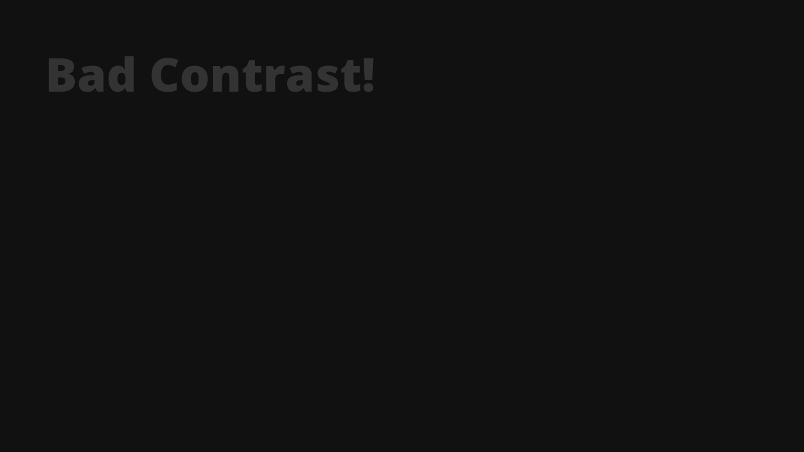
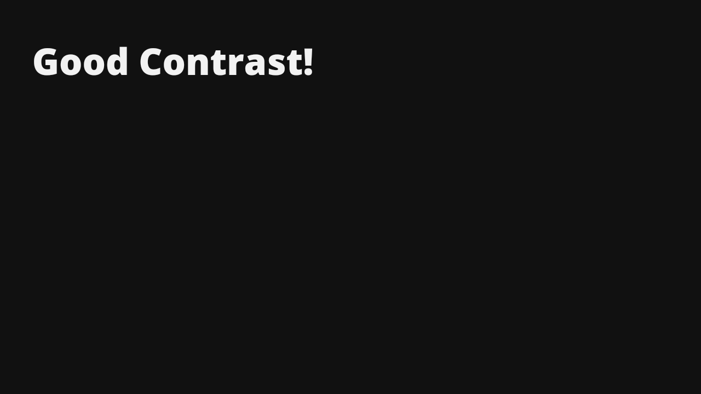

<!-- Banner -->

<!-- ENDOF Banner-->

<!-- Badges -->
<p align="left">
  
  <a href="https://twitter.com/vanzasetia" target="_blank"></a>
  
  
  
</p>
<!-- ENDOF Badges -->

<!-- CSS Validation Status -->
<p>
  <a href="http://jigsaw.w3.org/css-validator/check/referer">
    
    </a>
</p>
<!-- ENDOF CSS Validation Status -->

<!-- Title -->
# Random Quote Generator
<!-- Title -->

<!-- Table Of Contents -->
## Table of contents
- [Overview](#overview)
  - [The challenge](#the-challenge)
  - [Links](#links)
  - [Screenshots](#screenshots)
- [My process](#my-process)
  - [Built with](#built-with)
  - [What I learned](#what-i-learned)
  - [Useful resources](#useful-resources)
  - [Continued development](#continued-development)
- [How to contribute](#how-to-contribute)
  - [Practice](#practice)
  - [Prerequisite](#prerequisite)
  - [Setup](#setup)
- [Author](#author)
- [Acknowledgements](#acknowledgements)
- [License](#license)
- [References](#references)
<!-- ENDOF Table Of Contents -->

<!-- Overview -->
## Overview
[(Back to top)](#table-of-contents)

### The Challenge
You should:
- Have a basic knowledge of HTML, CSS, and JavaScript.
- Make it accessible for everyone by using HTML semantic tags, aria properties, and etc.

Users should be able to:
- View the optimal layout for the section depending on their device's screen size.
- Generate random quotes everytime they click the button.

### Links
- [🌐 Live Review](https://vanzaquotegenerator.netlify.app/)
- [📖 Code Newbie Article]()

### Screenshots

**Desktop**


**Mobile**


<!-- ENDOF Overview -->

<!-- My Process -->
## My Process
[(Back to top)](#table-of-contents)

### Built With
- HTML Semantic Tags
- Modern JavaScript
- Flexbox
- Mobile-first workflow
- [Normalize.css](https://necolas.github.io/normalize.css/)
- [Eruda - mobile console browser](https://github.com/liriliri/eruda)
- And many [NPM packages](#prerequisite) 😂

### General Structure


### What I Learned

#### Color Contrast
Basically your text color should have a good contrast with the background color, to make sure that everyone can read the text.

Example:

**Bad Color Contrast**



**Good Color Contrast**



As you can see, it's much easier to read the text on the second image than the first one. To learn more about color and contrast, you can check the [WebAIM article about Contrast and Color Accessibility](https://webaim.org/articles/contrast/).

### Useful Resources
- [Code Newbie | Absolute vs Relative Path](https://community.codenewbie.org/vanzasetia/relative-vs-absolute-file-paths-4j1n) - It's a great article to clarify the confusion between those methods.
- [Color Contrast Tester](https://colorable.jxnblk.com/) - Color contrast is important for accessibility. I used it when redesigned this app.
- [Inspiration](https://js-beginners.github.io/random-quotes-project/) - The inspiration is part of the [100+ JavaScript Projects for Beginners.](https://jsbeginners.com/javascript-projects-for-beginners/)
- [BEM By Examples](https://sparkbox.com/foundry/bem_by_example) - This helped me understand better about BEM. If you're still get confused about BEM, then check it out!
- [Icomoon](https://icomoon.io) - For the quotes icon
- [Github Markdown Cheat Sheet](https://guides.github.com/pdfs/markdown-cheatsheet-online.pdf) - If I forget about markdown syntax, then this is a file that I often refer to.
- [Flexbox Malven](https://flexbox.malven.co/) - If one day, I forget about flexbox, then this is a great reminder.
- [Can I Use](https://caniuse.com/) - It helped me to know whether or not that CSS property has been widely supported.

### Continued Development
Maybe after some time, I will refactor this code or I'm just gonna add small adjustment to this project.

<!-- ENDOF My Process -->

<!-- How To Contribute -->
## How To Contribute
[(Back to top)](#table-of-contents)

### Practice
If this the first time, you are starting to contribute to an open source, it might be confusing to follow along. I recommend to check this article about [make your first open-source contribution by Marco Denic](https://community.codenewbie.org/denicmarko/make-your-first-open-source-contribution-19k2). After that, you can come back and follow along.

### Prerequisite
- If you find bug, tpo, issue, grammar error, or anything that can be improved, then continue. If not, well just [skip to the next section](#author).
- You need to have [Node.js](https://nodejs.org/en/) installed on your machine. To check that you have Node.js, try to run this command on your terminal:
```shell
node --version
```
- You need all these packages **installed globally** to run all the scripts on `package.json`.
  - [Browsersync](https://browsersync.io/) for the development server.
  - [Sass](https://www.npmjs.com/package/sass) to compile Sass code into CSS.
  - [npm-run-all](https://www.npmjs.com/package/npm-run-all) to run the `devserver` and the `watch:sass` script simultaneously. Also, for the `build` script.
  - [Postcss](https://www.npmjs.com/package/postcss) to run autoprefixer.
  - [Autoprefixer](https://www.npmjs.com/package/autoprefixer) to add vendor prefixes if needed.
  - [Prettier](https://www.npmjs.com/package/prettier) to format the HTML code.
  - [csscomb](https://www.npmjs.com/package/csscomb) to format and sort the properties order the Sass and CSS files.
  - [standard](https://www.npmjs.com/package/standard) to format and check my JavaScript code.
  - [markserv](https://www.npmjs.com/package/markserv) live server for the markdown file. (Optional).

### Setup
- First, fork this repo.
- Clone this repo to your local machine with HTTPS or SSH.
- Navigate to this project folder using your favorite terminal.
- Add the project repository as the "upstream" remote.
  - In your project repository, click the download button and then copy the HTTPS URL.
  - Then type this and paste the URL.
```shell
git remote add upstream <url>
```
  - Use git `remote -v` to check that you now have two remotes.
- To make sure that you have the lastest version of the project repository, run this command.
```shell
git pull 
```
- Create a new branch, by execute this command. You can change the branch name based on what are you going to do, for this example I call it, `fixingbugs`.
```shell
git checkout -b fixingbugs
```
- Now, you can start editing the files. Run `npm start` for the development environment. `localhost:8080` for web development and `localhost:8642` for `README.md`.
- After you have finished editing, simply run `npm run build`.
- Add all files to staging area.
```shell
git add .
```
- Then, you can commit your changes.
```shell
git commit -m "Fixed bugs"
```
- Push your changes.
```shell
git push -u origin fixingbugs
```
- After that you can see the `Compare and Pull Request` button and follow the instructions.
- Finally, you can relax ☕ and wait for your `pull request` to be accepted.
<!-- ENDOF How To Contribute -->

<!-- Author -->
## Author
[(Back to top)](#table-of-contents)

- Frontend Mentor - [@vanzasetia](https://www.frontendmentor.io/profile/vanzasetia)
- Twitter - [@vanzasetia](https://www.twitter.com/vanzasetia)
- Facebook - [Vanza Setia](https://www.facebook.com/profile.php?id=100071874075732)
- Code Newbie - [@vanzasetia](https://community.codenewbie.org/vanzasetia)
<!-- ENDOF Author -->

<!-- Acknowledgements -->
## Acknowledgements
[(Back to top)](#table-of-contents)

## License
[(Back to top)](#table-of-contents)

>You can check out [the full license](https://github.com/vanzasetia/random-quote-generator/blob/master/LICENSE)

This project is licensed under the terms of the MIT license.

For those of you who are wondering, why do I need to license this? 
- Well, first it's free 😁.
- Second I check this [Choose license website](https://choosealicense.com/) to help me choose a license.
- The last reason, if I don't want to choose a license, then [here's what gonna happen](https://choosealicense.com/no-permission/).
<!-- ENDOF LICENSE -->

<!-- References -->
## References
[(Back to top)](#table-of-contents)

### Blog Posts
- [100+ JavaScript Projects for Beginners!](https://jsbeginners.com/javascript-projects-for-beginners/)
- [BEM By Examples](https://sparkbox.com/foundry/bem_by_example)
- [Code Newbie | Absolute vs Relative Path](https://community.codenewbie.org/vanzasetia/relative-vs-absolute-file-paths-4j1n)

### Others
- [choosealicense.com](https://choosealicense.com)
- [Shields.io](https://shields.io) - For all the badges.
- [Canva](https://canva.com) - For designing.
- [CSS Guidelines](https://cssguidelin.es/)
- [CSS Validator](https://jigsaw.w3.org/css-validator/)
- [HTML Validator](https://validator.w3.org/)
- [Font Converter](https://www.fontconverter.io/en) - Convert `ttf` to `woff` and `woff2`
- [Icomoon](https://icomoon.io)
- [SVGOMG](https://jakearchibald.github.io/svgomg/) - Optimize your SVG files without hard work

<!-- ENDOF References -->